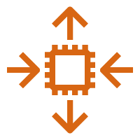

# Compute

## Servicios
* [EC2](https://aws.amazon.com/ec2)
* [Lightsail](https://aws.amazon.com/lightsail)
* [Lambda](https://aws.amazon.com/lambda)
* [Batch](https://aws.amazon.com/batch)
* [Elastic Beanstalk](https://aws.amazon.com/elasticbeanstalk)
* [Serverless Application Repository](https://aws.amazon.com/serverless/serverlessrepo/)
* [AWS Outposts](https://aws.amazon.com/outposts/)
* [EC2 Image Builder](https://aws.amazon.com/image-builder/)
